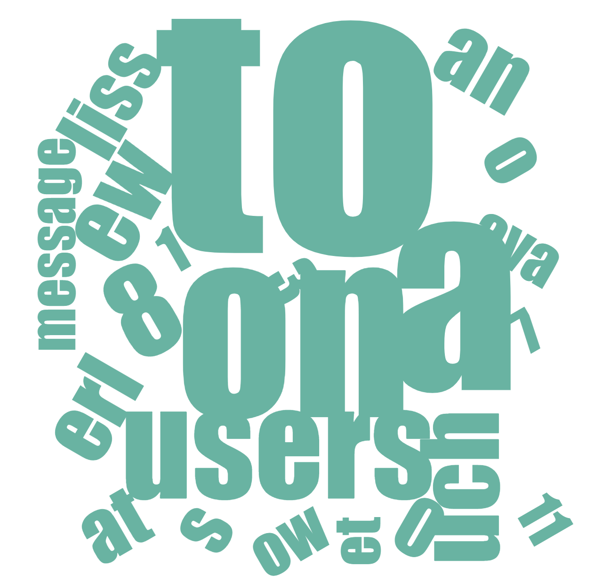
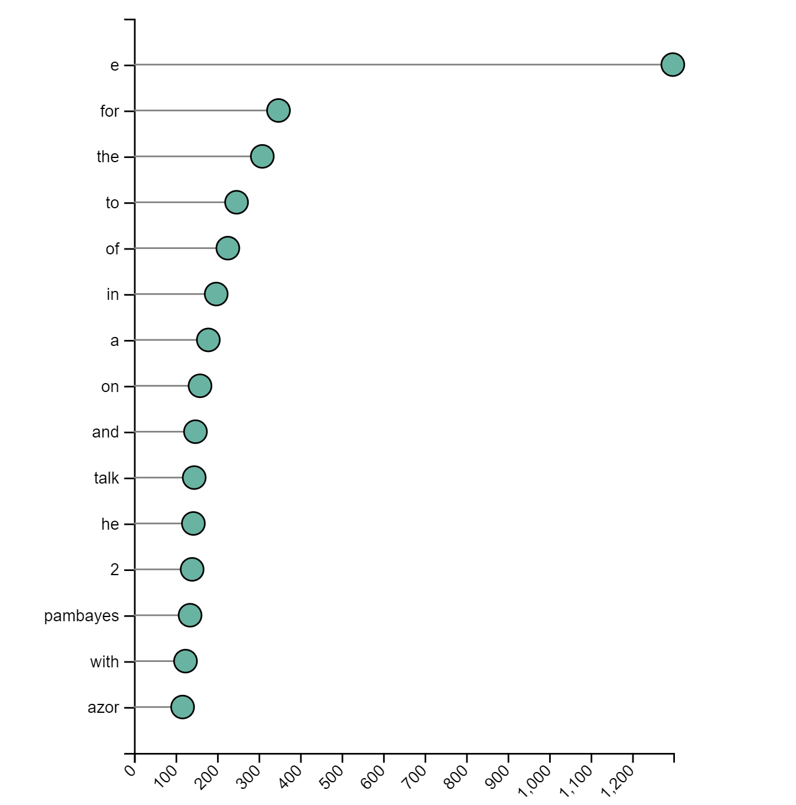

# Data Science Lab's Text Analysis

A list of plugins to visualize text and perform sentiment analysis.

Plugins include:
* Word Cloud
* Word Lollipop
* Naive Bayes Binary Classifier

## Word Cloud

## Word Lollipop

## Naive Bayes Binary Classifer

